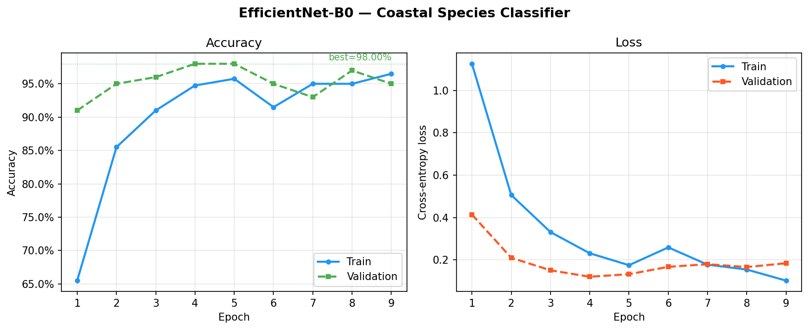
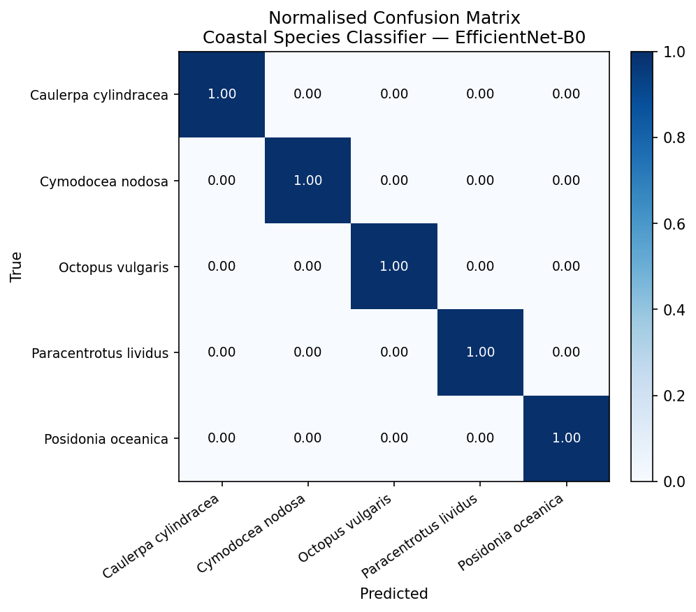

# Coastal Species Image Classifier

Transfer-learning pipeline for automated species identification from field photographs, using EfficientNet-B0 fine-tuned on iNaturalist occurrence images. Designed as a proof-of-concept for image-based biodiversity monitoring in Mediterranean and Atlantic coastal ecosystems.

## Why this matters

Automated species recognition from photographs is a key bottleneck in large-scale biodiversity monitoring. Camera traps, drone surveys, and citizen science platforms (iNaturalist, GBIF) produce millions of images annually that cannot be manually annotated at scale. This project demonstrates how a pretrained vision model can be efficiently adapted to a domain-specific monitoring task with limited labelled data — a core challenge in applied conservation ML.

## Species

| Class | Taxon ID | Ecological role |
|---|---|---|
| *Posidonia oceanica* | 118943 | Mediterranean endemic seagrass; critical habitat engineer, EU Habitats Directive Annex I |
| *Cymodocea nodosa* | 130222 | Coastal seagrass; coloniser of disturbed sandy beds |
| *Caulerpa cylindracea* | 128823 | Invasive green alga; priority monitoring species across Mediterranean MPAs |
| *Paracentrotus lividus* | 48032 | Sea urchin; benthic biodiversity indicator, interacts directly with seagrass beds |

## Model

- **Architecture**: EfficientNet-B0 (pretrained on ImageNet-1K)
- **Training strategy**: Two-stage — head-only warmup (92% val acc), then full fine-tune with cosine LR decay
- **Regularisation**: Dropout (0.3), AdamW (weight decay 1e-4), early stopping (patience=5)
- **Input**: 224×224 RGB, ImageNet normalisation
- **Augmentation**: RandomResizedCrop, RandomHorizontalFlip, ColorJitter

## Results

| Metric | Value |
|---|---|
| Best validation accuracy | **98%** (full fine-tune, epoch 4) |
| Head-only warmup accuracy | 92% (10 epochs) |
| Training images | 400 (80/20 split from 500 research-grade iNaturalist observations) |
| Epochs to convergence | 9 (early stopping) |
| Per-class F1 | 1.00 for all 4 species |





> **Note on scale**: The 100-image-per-class dataset is an intentional proof-of-concept. The high validation accuracy reflects the visual distinctiveness of these five species rather than general robustness; production deployment would require ≥1,000 images per class, a held-out test set, and evaluation on out-of-distribution field imagery.

## Quickstart

```bash
git clone https://github.com/alvaropenuelas/species-image-classifier
cd species-image-classifier
python -m venv venv && source venv/bin/activate
pip install -r requirements.txt

# 1. Download images (~500 research-grade observations from iNaturalist)
python download_data.py --per-species 100

# 2. Train — head only first (~30 min CPU)
python main.py --feature-extract --epochs 10

# 3. Full fine-tune (~30 min CPU)
python main.py --epochs 20 --lr 3e-4

# 4. Evaluate — per-class report and confusion matrix
python evaluate.py

# 5. Predict on a new image
python src/predict.py --model outputs/best_model.pt --classes outputs/classes.json --image my_photo.jpg
```

## Project structure

```
species-image-classifier/
├── main.py                 # Training entry point
├── download_data.py        # iNaturalist API data fetcher
├── evaluate.py             # Per-class metrics and confusion matrix
├── plot_results.py         # Training curve visualisation
├── requirements.txt
├── assets/                 # Figures committed to the repo
│   ├── training_curves.png
│   └── confusion_matrix.png
├── src/
│   ├── dataset.py          # DataLoader, augmentation, train/val split
│   ├── model.py            # EfficientNet-B0 with replaceable classification head
│   ├── train.py            # Training loop, early stopping, LR scheduling, checkpointing
│   └── predict.py          # Inference on single image or folder
├── data/raw/               # ⬇ created locally by download_data.py (gitignored, ~500 imgs)
│   ├── Posidonia_oceanica/
│   ├── Cymodocea_nodosa/
│   ├── Caulerpa_cylindracea/
│   ├── Paracentrotus_lividus/
└── outputs/                # ⬇ created locally during training (gitignored)
    ├── best_model.pt
    ├── classes.json
    └── history.json
```

## Limitations and next steps

- **Scale**: 100 images per class is a minimal proof-of-concept. Production deployment would require ≥1,000 images per class and broader species coverage.
- **Domain gap**: iNaturalist images vary widely in quality, depth, and lighting. Underwater and drone imagery differ substantially from terrestrial ImageNet pretraining; domain adaptation techniques (e.g. MixUp, domain-adversarial training) would improve robustness.
- **Towards VLMs**: The natural extension of this work is zero-shot or few-shot species identification using vision-language models (e.g. CLIP, BioViL-T) that do not require per-species retraining — a core challenge in open-world biodiversity monitoring at drone and satellite scale.

## Stack

Python 3.10+ · PyTorch 2.10 · torchvision 0.25 · scikit-learn · Matplotlib · Pillow · requests · iNaturalist API v1
